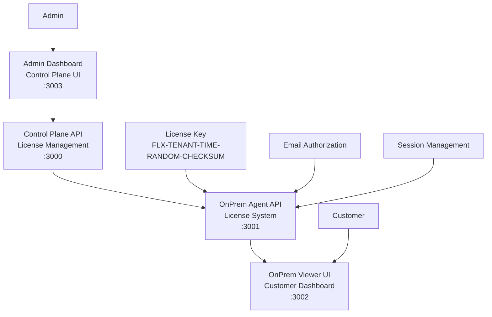

# 🔐 FlexBoard OnPrem License Management System

## Complete Enterprise-Grade License Management Flow

This document describes the complete **OnPrem License Management System** that enables secure, enterprise-grade dashboard deployment with Windows-style license activation.

## 🏗️ System Architecture



## 🚀 Complete Flow Overview

### 1. **Admin License Generation Flow**

```
Admin → Control Plane UI → OnPrem Licenses Tab → Generate License →
Control Plane API → OnPrem Agent → Crypto Key Generation → License Key
```

### 2. **Customer Authentication Flow**

```
Customer → OnPrem Viewer → License Key Input → Email Authorization →
OnPrem Agent Validation → Session Creation → Dashboard Access
```

### 3. **Session Management Flow**

```
Active Session → Auto Validation → Concurrent User Limits →
Session Expiry → Auto Logout → License Renewal
```

## 📂 System Components

### **Control Plane (Admin System)**

- **Control Plane UI** (:3003) - Admin dashboard for license management
- **Control Plane API** (:3000) - Backend API for admin operations
- **Features**: License generation, tenant management, license monitoring

### **OnPrem System (Customer System)**

- **OnPrem Agent API** (:3001) - License validation and session management
- **OnPrem Viewer UI** (:3002) - Customer dashboard interface
- **Features**: License validation, secure dashboard access, session control

## 🔧 Quick Start

### Option 1: Complete System Test (Recommended)

```bash
# Start all services with comprehensive testing
./scripts/test-complete-onprem-system.sh
```

### Option 2: Manual Service Startup

```bash
# 1. Start Control Plane API (Admin Backend)
cd apps/control-plane-api
pnpm install && pnpm build
PORT=3000 pnpm start

# 2. Start Control Plane UI (Admin Frontend)
cd apps/control-plane-ui
pnpm install && pnpm build
PORT=3003 pnpm start

# 3. Start OnPrem Agent API (License System)
cd apps/onprem-agent-api
pnpm install && pnpm build
PORT=3001 pnpm start

# 4. Start OnPrem Viewer UI (Customer Frontend)
cd apps/onprem-viewer-ui
pnpm install && pnpm build
PORT=3002 pnpm start
```

## 🎯 Usage Instructions

### **Step 1: Admin License Generation**

1. Open **Admin Dashboard**: http://localhost:3003
2. Navigate to tenant (e.g., `vpi-co-ltd`)
3. Click **"🔐 OnPrem Licenses"** button
4. Click **"+ Generate License"**
5. Fill in license details:
   - Company Name
   - Authorized Email
   - Max Concurrent Users
   - Expiry Date
6. Generated license key format: `FLX-TENANT-TIMESTAMP-RANDOM-CHECKSUM`

### **Step 2: Customer OnPrem Access**

1. Open **OnPrem Viewer**: http://localhost:3002
2. Enter **License Key** (from Step 1)
3. Enter **Authorized Email**
4. Click **"Access Dashboard"**
5. View secure OnPrem dashboards

### **Step 3: Session Management**

- **Auto-Login**: Session persists in localStorage
- **Session Validation**: Automatic session checks
- **Concurrent Limits**: Enforced user limits
- **Auto-Logout**: On session expiry or manual logout

## 🔐 Security Features

### **Enterprise-Grade Security**

- ✅ **Crypto-based License Keys** - Secure key generation with checksums
- ✅ **Email Authorization** - Only authorized emails can access
- ✅ **Session Management** - JWT-like session tokens with expiry
- ✅ **Concurrent User Limits** - Control simultaneous access
- ✅ **Admin Key Protection** - Secure license generation
- ✅ **Anti-tampering** - License validation with crypto verification

### **Windows-Style Activation**

- License keys similar to Windows product keys
- Email-based authorization system
- Time-limited licenses with expiry management
- Session-based authentication system
- Audit logging for all authentication events

## 📡 API Endpoints

### **Control Plane API** (:3000)

```bash
# License Management
POST /api/tenants/{tenantId}/onprem-licenses    # Generate license
GET  /api/tenants/{tenantId}/onprem-licenses    # List licenses
POST /api/tenants/{tenantId}/onprem-licenses/revoke  # Revoke license

# Tenant Management
GET  /api/tenants                               # List tenants
GET  /api/tenants/{tenantId}                    # Get tenant details
```

### **OnPrem Agent API** (:3001)

```bash
# License System
POST /api/license/generate                      # Generate license key (admin)
POST /api/license/validate                      # Validate license + create session
POST /api/license/session/validate             # Check session validity
POST /api/license/logout                       # Terminate session
GET  /api/license/info                          # Get license information
GET  /health                                    # Health check
```

## 🧪 Testing & Validation

### **Automated Testing**

```bash
# Complete system test with all components
./scripts/test-complete-onprem-system.sh

# OnPrem system only
./scripts/test-onprem-system.sh
```

### **Manual Testing Scenarios**

1. **License Generation Test**

   ```bash
   curl -X POST http://localhost:3000/api/tenants/vpi-co-ltd/onprem-licenses \
     -H "Content-Type: application/json" \
     -d '{"adminKey": "admin-secret-key-2024", "companyName": "Test Corp", "email": "test@corp.com", "expiryDate": "2025-12-31"}'
   ```

2. **License Validation Test**

   ```bash
   curl -X POST http://localhost:3001/api/license/validate \
     -H "Content-Type: application/json" \
     -d '{"licenseKey": "YOUR_LICENSE_KEY", "email": "test@corp.com"}'
   ```

3. **Session Validation Test**
   ```bash
   curl -X POST http://localhost:3001/api/license/session/validate \
     -H "Content-Type: application/json" \
     -d '{"sessionId": "YOUR_SESSION_ID"}'
   ```

## 📊 License Management Dashboard

### **Admin Dashboard Features**

- 📋 **License Overview**: Total, active, expired licenses
- 🔑 **License Generation**: Easy license creation with form
- 👥 **Session Monitoring**: Active sessions and user counts
- 📈 **Usage Analytics**: License usage statistics
- ⚡ **Quick Actions**: Generate, revoke, monitor licenses

### **OnPrem Viewer Features**

- 🔐 **License Authentication**: Secure login with license key
- 📊 **Dashboard Access**: Multiple dashboard views
- 🎨 **Interactive Widgets**: Charts, metrics, KPIs
- 🔄 **Real-time Data**: Live data refresh
- 💼 **Company Branding**: Customizable company interface

## 🚨 Troubleshooting

### **Common Issues**

#### **License Generation Fails**

```bash
# Check Control Plane API
curl http://localhost:3000/api/health

# Check OnPrem Agent connection
curl http://localhost:3001/health

# Verify admin key
echo "Check admin key: admin-secret-key-2024"
```

#### **License Validation Fails**

```bash
# Verify license key format
echo "Key should match: FLX-TENANTID-TIMESTAMP-RANDOM-CHECKSUM"

# Check email authorization
curl -X POST http://localhost:3001/api/license/validate \
  -H "Content-Type: application/json" \
  -d '{"licenseKey": "YOUR_KEY", "email": "AUTHORIZED_EMAIL"}'
```

#### **OnPrem Viewer Connection Issues**

```bash
# Check if services are running
curl http://localhost:3001/health  # OnPrem Agent
curl http://localhost:3002         # OnPrem Viewer

# Clear browser session
localStorage.removeItem('flexboard_session');
```

## 🌟 Enterprise Deployment

### **Production Configuration**

```bash
# Environment Variables
ADMIN_SECRET_KEY=your-secure-admin-key
LICENSE_DATA_PATH=/secure/path/licenses
SESSION_DATA_PATH=/secure/path/sessions
ONPREM_AGENT_URL=https://your-agent.company.com
```

### **Security Hardening**

- Change all default admin keys
- Use HTTPS for all communications
- Implement proper firewall rules
- Secure license data storage
- Configure session timeouts
- Enable audit logging

### **Scalability Options**

- Load balancing for OnPrem Agent
- Database clustering for license storage
- CDN integration for static assets
- Horizontal scaling capabilities
- Multi-region deployment

## 🎉 Success Metrics

### **System Status Indicators**

- ✅ All services running (4/4)
- ✅ License generation functional
- ✅ OnPrem viewer accessible
- ✅ Session management active
- ✅ Security features enabled

### **Flow Validation Checklist**

- [ ] Admin can generate licenses via Control Plane UI
- [ ] Control Plane API forwards requests to OnPrem Agent
- [ ] OnPrem Agent generates crypto-secure license keys
- [ ] Customers can authenticate with license keys
- [ ] OnPrem Viewer validates sessions automatically
- [ ] Session management enforces concurrent user limits
- [ ] License expiry is properly handled

## 📞 Support & Documentation

- 📖 **OnPrem Deployment Guide**: `/docs/ONPREM_DEPLOYMENT.md`
- 🔧 **Technical Implementation**: `/docs/TECHNICAL_IMPLEMENTATION_GUIDE.md`
- 🚀 **Complete System Documentation**: `/docs/FLEXBOARD_COMPLETE_DOCUMENTATION.md`

---

**🔒 FlexBoard OnPrem License Management - Enterprise-Grade Security with Windows-Style Activation**
